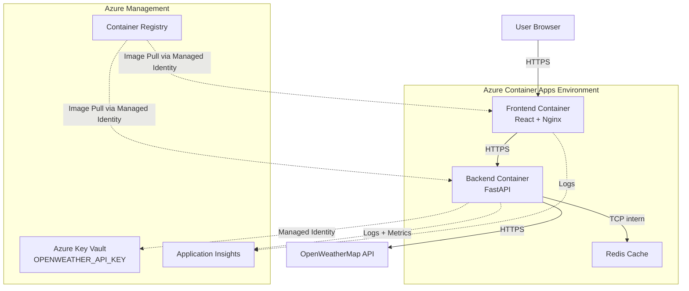

# WeatherWise – Cloud Deployment

> **LB2 Vertiefungsprojekt – Modul Deployment**
> HF Informatik · GIBB Bern · Mai 2026
> Autor: Mehmet Ali Gür

[](https://github.com/maliswiss/weatherwise-azure-cloud-native-platform/actions/workflows/ci.yml)
[](https://azure.microsoft.com/)
[](backend/Dockerfile)
[](LICENSE)

---

## Projektübersicht

**WeatherWise** ist eine produktionsreife Wetter-Web-Applikation, die als
**Fullstack-Container-Setup** in Azure deployed wird. Im Vordergrund steht
nicht die Applikation selbst, sondern das **vollständige Deployment-Handwerk**:
Containerisierung, CI/CD-Pipeline, Cloud-Deployment, Secret-Management,
Monitoring und Reproduzierbarkeit.

### Was die Anwendung tut

Die Benutzer suchen nach Städten oder verwenden ihre Geolokalisierung und
erhalten:

- Aktuelle Wetterdaten (Temperatur, Wind, Feuchtigkeit, Luftdruck, …)
- 5-Tages-Vorhersage
- Stündliche Prognose (nächste 24 Stunden)
- Persönliche Favoritenverwaltung (LocalStorage)

Wetterdaten kommen von der OpenWeatherMap-API. Das **eigene Backend** dient
als Proxy mit Caching, damit der API-Schlüssel nie im Browser erscheint.

---

## Architekturübersicht

### High-Level-Diagramm



### Services und ihre Kommunikation

| Service | Technologie | Port intern | Public | Aufgabe |
|---------|-------------|-------------|--------|---------|
| **Frontend** | React 19 + TypeScript + Vite + Nginx | 8080 | ✅ HTTPS | Statische SPA-Auslieferung |
| **Backend** | FastAPI + Python 3.12 | 8000 | ✅ HTTPS | Weather-Proxy mit Cache |
| **Redis** | Redis 7 Alpine | 6379 | ❌ intern | In-Memory-Cache |

### Datenfluss bei einer Wetter-Abfrage

1. User tippt "Bern" und klickt **Suchen**
2. Browser → `GET https://weatherwise-frontend-prod.azurecontainerapps.io`
3. Frontend lädt → Ruft `GET https://weatherwise-backend-prod.../api/weather?city=Bern`
4. Backend prüft Redis-Cache (`weather:city:bern:metric`)
   - **Cache-HIT** → Sofort Antwort
   - **Cache-MISS** → OpenWeatherMap-API, Antwort cachen, Antwort senden
5. Frontend rendert das WeatherCard-Component

---

## Technologie-Stack

### Application Layer

| Bereich | Wahl | Begründung |
|---------|------|------------|
| **Frontend** | React 19 + TypeScript + Vite | Type-Safety, schneller Build |
| **Backend** | FastAPI (Python 3.12) | Async, OpenAPI auto-doc, Pydantic |
| **State** | Zustand (Frontend) | Leichtgewichtig, ohne Boilerplate |
| **Cache** | Redis 7 Alpine | Industrie-Standard, klein |
| **Styling** | CSS Modules | Keine zusätzliche Library nötig |

### Deployment Layer

| Bereich | Wahl | Begründung |
|---------|------|------------|
| **Container** | Docker + Multi-Stage + Non-Root | Sicherheit + kleine Images |
| **Orchestrierung lokal** | Docker Compose | Ein Befehl startet alles |
| **Cloud-Plattform** | Azure Container Apps (ACA) | Managed Kubernetes ohne Overhead |
| **Container Registry** | Azure Container Registry (ACR) | Native Integration mit ACA |
| **Secret Management** | Azure Key Vault + Managed Identity | Industrie-Standard, kein Secret im Code |
| **Monitoring** | Application Insights + Log Analytics | Native Cloud-Monitoring |
| **IaC** | Bicep | Azure-native, einfacher als ARM |
| **CI/CD** | GitHub Actions | Free für Public Repos, exzellente Azure-Integration |

---

## Setup-Anleitung

### Voraussetzungen

- **Docker Desktop** (https://www.docker.com/products/docker-desktop)
- **Git**
- **OpenWeatherMap API-Key** (kostenlos: https://openweathermap.org/api)
- Optional für Cloud-Deployment: **Azure-Account** mit aktivem Abo

### Lokales Setup (Schritt 1: Klonen)

```bash
git clone https://github.com/maliswiss/weatherwise-azure-cloud-native-platform.git
cd weatherwise-azure-cloud-native-platform
```

### Lokales Setup (Schritt 2: Environment)

```bash
# Vorlage kopieren
cp .env.example .env

# .env editieren und OPENWEATHER_API_KEY eintragen
notepad .env       # Windows
nano .env          # Linux/Mac
```

### Lokales Setup (Schritt 3: Starten)

**Windows (PowerShell):**

```powershell
.\start.ps1
```

**Linux/Mac (Bash):**

```bash
chmod +x start.sh
./start.sh
```

**Manuell:**

```bash
docker compose up --build
```

### Erreichbar unter

| Service | URL |
|---------|-----|
| Frontend | http://localhost:8080 |
| Backend API | http://localhost:8000 |
| API-Docs (Swagger) | http://localhost:8000/docs |
| Health-Endpoint | http://localhost:8000/health |

### Stoppen

```bash
docker compose down       # Container stoppen
docker compose down -v    # Auch Volumes löschen
```

---

## Cloud-Deployment (Azure)

### Schritt 1: Azure-Vorbereitung

```powershell
# Azure CLI installieren: https://aka.ms/installazurecli
az login
az account set --subscription "Azure for Students"

# Initial-Setup durchführen (erstellt RGs, ACRs, Service Principal)
.\scripts\azure-setup.ps1
```

Das Skript gibt am Ende eine **JSON-Ausgabe** für GitHub Secrets aus.

### Schritt 2: GitHub Secrets eintragen

Im GitHub-Repository → **Settings → Secrets and variables → Actions**:

| Secret | Wert |
|--------|------|
| `AZURE_CREDENTIALS` | JSON-Output aus `azure-setup.ps1` |
| `OPENWEATHER_API_KEY_DEV` | Dein API-Key (Dev) |
| `OPENWEATHER_API_KEY_PROD` | Dein API-Key (Prod) |
| `DEV_BACKEND_URL` | (nach erstem Deploy: `https://weatherwise-backend-dev....azurecontainerapps.io`) |
| `PROD_BACKEND_URL` | (nach erstem Deploy: `https://weatherwise-backend-prod....azurecontainerapps.io`) |

### Schritt 3: Branch-Strategie nutzen

- Push auf `develop` → automatischer Deploy in **DEV-Umgebung**
- Push auf `main` → automatischer Deploy in **PROD-Umgebung**

---

## Branch-Strategie

```
main      ←  Production-Branch (PROD-Deployment automatisch)
  ↑ merge
develop   ←  Development-Branch (DEV-Deployment automatisch)
  ↑ branch
feature/* ←  Feature-Branches (nur CI, kein Deployment)
```

**Workflow:**

1. Neue Funktion → `feature/xyz` Branch
2. Pull Request → `develop`
3. CI läuft (Lint + Test + Build + Trivy)
4. Merge → DEV-Deploy automatisch
5. Nach Tests → PR `develop` → `main`
6. Merge → PROD-Deploy automatisch

---

## Multi-Environment-Setup

| Aspekt | DEV | PROD |
|--------|-----|------|
| Resource Group | `weatherwise-dev-rg` | `weatherwise-prod-rg` |
| Container Registry | `weatherwiseacrdev` | `weatherwiseacrprod` |
| Key Vault | `weatherwise-kv-dev-...` | `weatherwise-kv-prod-...` |
| Backend URL | `weatherwise-backend-dev.../` | `weatherwise-backend-prod.../` |
| Frontend URL | `weatherwise-frontend-dev.../` | `weatherwise-frontend-prod.../` |
| Min. Replicas | 0 (Scale-to-Zero) | 1 (immer warm) |
| Max. Replicas | 2 | 3 |
| Backend CPU | 0.5 vCPU | 0.5 vCPU |

---

## Entscheidungsbegründungen

Detaillierte Begründungen siehe [`docs/DECISIONS.md`](docs/DECISIONS.md).

### Warum FastAPI Proxy statt direktem API-Call?

**Problem:** Wenn das Frontend den OpenWeatherMap-API-Key direkt verwendet,
landet er im Browser-Bundle und kann von jedem über DevTools eingesehen werden.

**Lösung:** Eigenes Backend, das den API-Key serverseitig hält. Das Frontend
spricht nur mit dem eigenen Backend, der API-Key verlässt nie die Server-Seite.

**Bonus:** Caching reduziert OpenWeatherMap-Rate-Limit-Risiko und beschleunigt
Antworten für wiederholte Abfragen.

### Warum Azure Container Apps (ACA) statt AKS?

| Kriterium | ACA | AKS |
|-----------|-----|-----|
| Setup-Aufwand | gering | hoch |
| Kontrolle | Mittel | Voll |
| Kosten (Control Plane) | 0 €/Monat | ca. 70 €/Monat |
| Komplexität | moderat | hoch |
| Geeignet für | Single-Team-Projekte | Multi-Team-Enterprise |

ACA basiert intern auf Kubernetes (managed), liefert also K8s-Vorteile
(Probes, Scaling, Rolling Update) ohne den operativen Overhead.

### Warum Bicep statt Terraform?

- **Azure-native** → kein State-Backend nötig
- **Bessere IntelliSense** in VS Code
- **Direkt von Microsoft gepflegt**
- Kürzere Syntax als ARM-Templates

Für ein Multi-Cloud-Setup wäre Terraform die bessere Wahl. Da das Projekt
ausschließlich Azure verwendet, ist Bicep die pragmatische Lösung.

### Warum Managed Identity statt Service Principal für Backend → Key Vault?

- **Keine Credentials zu rotieren**
- **Keine Secrets in Environment-Variablen**
- **Audit-Trail in Azure AD**

---

## Learnings (Reflexion)

### Was gut funktioniert hat

- **Multi-Stage Dockerfile** reduziert Backend-Image von 950 MB auf 180 MB
- **Non-Root User** wurde von Anfang an mit eingebaut, statt nachträglich
- **Docker Compose** mit `depends_on: condition: service_healthy` verhindert
  Race Conditions beim Start

### Was rückblickend anders gemacht würde

1. **Test-Setup früher**: Tests wurden erst spät hinzugefügt. Beim nächsten
   Projekt würde ich mit einem Smoke-Test starten und parallel zur
   Feature-Entwicklung Tests schreiben.

2. **Application Insights früher integrieren**: Erst nach dem ersten
   Deployment wurde Monitoring eingebaut. Frühe Integration hätte
   beim Debugging der Container Apps geholfen.

3. **Bicep What-If-Vorschau ernster nehmen**: Bei einem Deploy hat ein
   Tippfehler in den Parametern zur Erstellung doppelter Ressourcen geführt.
   `az deployment group what-if` würde ich jetzt vor jedem Deploy ausführen.

4. **Frontend-Tests fehlen noch**: Die Pipeline testet aktuell nur das
   Backend mit Pytest. Bei einem Folgeprojekt würde ich Playwright oder
   Vitest für E2E-Tests einbauen.

---

## Projektstruktur

```
weatherwise-azure-cloud-native-platform/
├── .github/
│   └── workflows/
│       ├── ci.yml                    # Lint + Test + Build + Trivy
│       ├── deploy-dev.yml            # develop → Azure DEV
│       └── deploy-prod.yml           # main → Azure PROD
│
├── backend/
│   ├── app/
│   │   └── main.py                   # FastAPI-App
│   ├── tests/
│   │   ├── conftest.py               # Test-Fixtures
│   │   └── test_main.py              # Unit + Integration Tests
│   ├── Dockerfile                    # Multi-Stage, Non-Root
│   ├── requirements.txt
│   ├── requirements-dev.txt          # Test-Dependencies
│   └── pyproject.toml                # Ruff, Pytest Konfiguration
│
├── frontend/
│   ├── src/
│   │   ├── components/               # React-Komponenten
│   │   ├── pages/                    # Routen
│   │   ├── services/weatherApi.ts    # Backend-Client
│   │   └── store/weatherStore.ts     # Zustand State
│   ├── Dockerfile                    # Multi-Stage, Nginx, Non-Root
│   ├── nginx.conf                    # Security-Headers, SPA-Routing
│   └── package.json
│
├── infra/                            # Bicep IaC
│   ├── main.bicep                    # Orchestrierung
│   ├── modules/
│   │   ├── container-apps.bicep      # Frontend + Backend + Redis
│   │   ├── key-vault.bicep
│   │   └── log-analytics.bicep
│   └── parameters/
│       ├── dev.parameters.json
│       └── prod.parameters.json
│
├── scripts/
│   ├── azure-setup.ps1               # Initial Azure-Setup
│   └── azure-teardown.ps1            # Alles löschen
│
├── docs/                             # Erweiterte Dokumentation
│   ├── ARCHITECTURE.md
│   ├── DECISIONS.md
│   └── RUNBOOK.md
│
├── docker-compose.yml                # Lokales Setup
├── .env.example                      # ENV-Vorlage
├── .gitignore
├── start.ps1                         # Windows-Start
├── start.sh                          # Linux/Mac-Start
└── README.md                         # ← Du bist hier
```

---

## Bewertungskriterien (LB2)

| # | Kriterium | Lösung |
|---|-----------|--------|
| K1 | Containerisierung | Multi-Stage, Non-Root, Alpine, < 200 MB |
| K2 | CI/CD-Pipeline | GitHub Actions: lint → test → scan → build → deploy |
| K3 | Konfiguration und Secrets | Azure Key Vault + Managed Identity + Multi-Env |
| K4 | Deployment-Ziel | Azure Container Apps, HTTPS, Healthchecks |
| K5 | README | Dieses Dokument |
| K6 | Screencast | Siehe Repo-Description |
| K7 | Entscheidungen | siehe `docs/DECISIONS.md` |
| K8 | Security | Non-Root + HTTPS + Trivy + Security-Headers |
| K9 | Reproduzierbarkeit | `docker compose up` oder `.\start.ps1` |
| K10 | Komplexität | Multi-Service, IaC, Monitoring, Multi-Env, E2E-Tests |

---

## Lizenz

MIT License – Mehmet Ali Gür © 2026

---

## Autor

**Mehmet Ali Gür**
HF Informatik · GIBB Bern · Mai 2026
