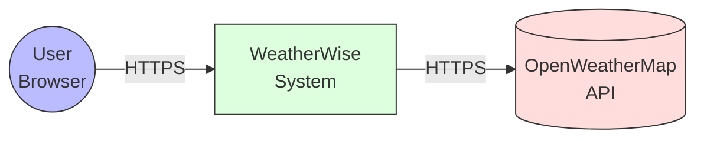
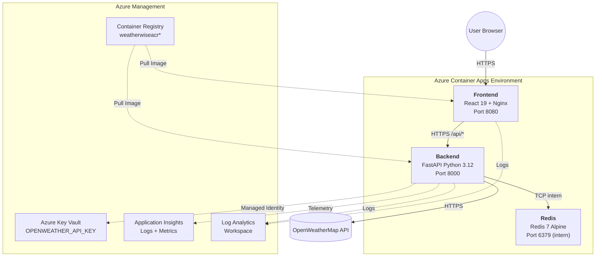
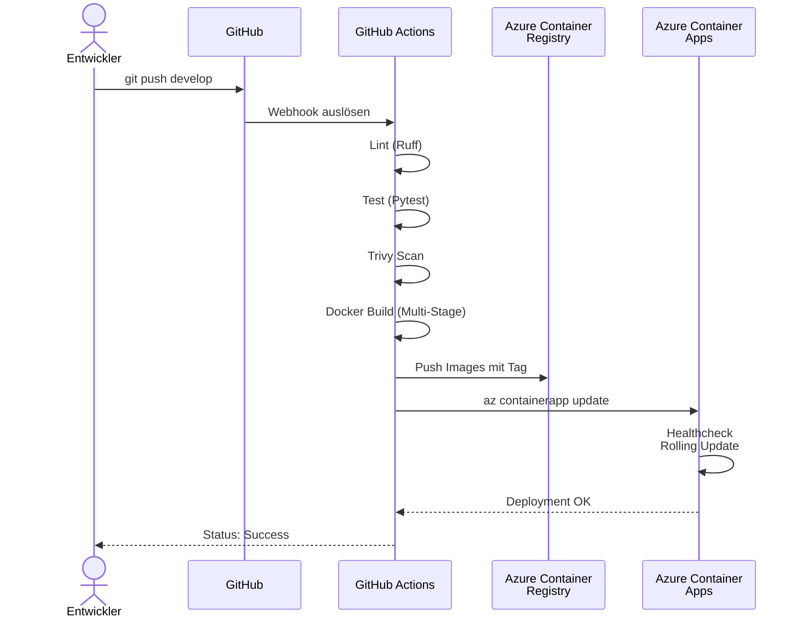
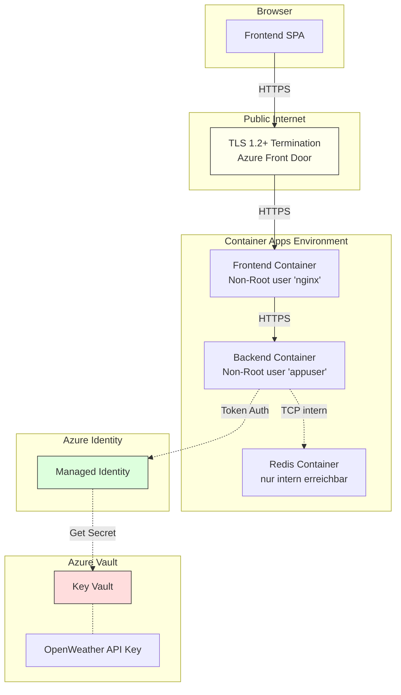

# Architektur-Übersicht

## Systemkontext



## Container-Diagramm



## Deployment-Pipeline



## Sicherheitsarchitektur



## Lifecycle eines API-Aufrufs

1. **User-Aktion:** Tippt "Bern" und klickt **Suchen**
2. **Frontend:** `fetch('https://backend.../api/weather?city=Bern')`
3. **Backend Empfang:**
   - Validierung der Query-Parameter via Pydantic
   - Cache-Key bilden: `weather:city:bern:metric`
4. **Cache-Check:**
   - **HIT** → Sofort JSON zurückgeben (typisch < 10ms)
   - **MISS** → Weiter zu Schritt 5
5. **OpenWeatherMap-Call:**
   - `httpx.AsyncClient` GET-Request mit API-Key
   - Timeout 10 Sekunden
6. **Cache-Write:** Antwort in Redis speichern (TTL 600s)
7. **Response:** JSON an Frontend
8. **Frontend Render:** WeatherCard-Komponente zeigt Daten

## Healthcheck-Strategie

| Endpoint | Probe-Typ | Intervall | Timeout | Zweck |
|----------|-----------|-----------|---------|-------|
| `/health` (Backend) | Startup | 5s | 3s | Initialer Start (max. 50s) |
| `/health` (Backend) | Readiness | 10s | 3s | Traffic erst nach OK |
| `/health` (Backend) | Liveness | 30s | 5s | Container-Restart bei Fehler |
| `/health` (Frontend) | Readiness | 10s | 3s | Nginx-Status |
| `/health` (Frontend) | Liveness | 30s | 3s | Container-Restart |

Backend-Health-Response (Beispiel):

```json
{
  "status": "ok",
  "environment": "prod",
  "redis": "ok",
  "api_key_configured": true
}
```

## Skalierung

| Service | Min | Max | Trigger |
|---------|-----|-----|---------|
| Frontend | 1 | 3 | > 50 gleichzeitige Requests |
| Backend | 1 | 3 | > 30 gleichzeitige Requests |
| Redis | 1 | 1 | (Single Instance) |

In DEV ist `minReplicas: 0` aktiviert → Scale-to-Zero → spart Kosten.

## Logging und Monitoring

- **Strukturierte Logs:** Backend schreibt nach `stdout` im Format
  `<timestamp> [<level>] <logger>: <message>`
- **Application Insights:** Auto-Instrumentation für HTTP-Calls
- **Log Analytics Workspace:** Aggregiert Logs aller Container Apps
- **Custom Metrics:** Cache-HIT/MISS-Rate (geplant für v2)

---

<div align="center">

**Mehmet Ali Gür – HF Informatik**
**Mai 2026**

</div>
